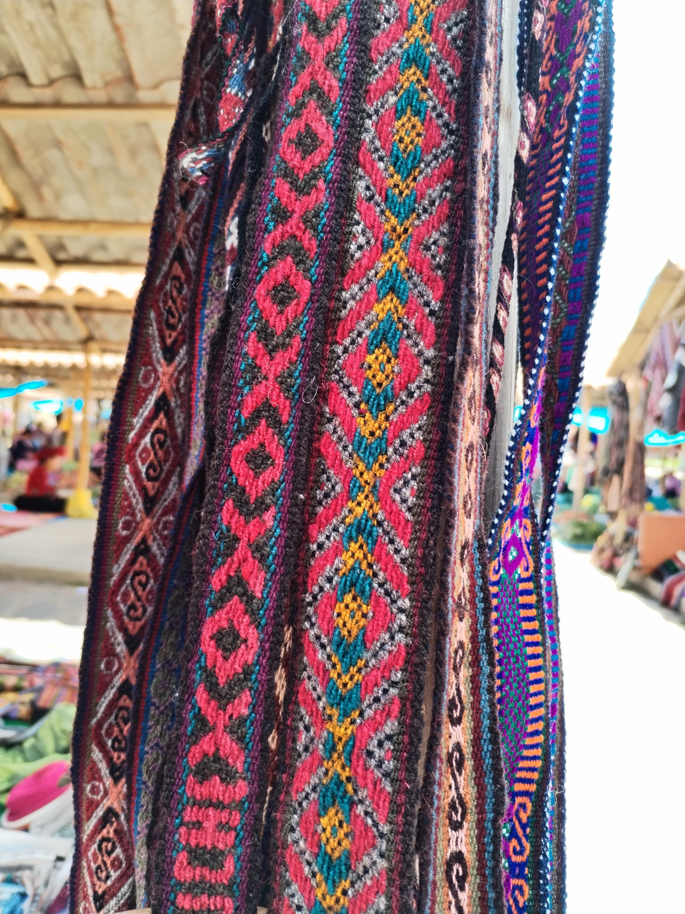

brocade-AI
Machine-learning experiments on CHINTEXDB-PERU28, a dataset of traditional
textile iconography from Chinchero (Cusco, Peru). Weavers there encode meaning in
their fabrics through named motifs — Chaska (star), Loraypu, Llama,
MakiMaki and two dozen more — and every occurrence of every motif in the
photographs has been annotated with a bounding box.
The repository works that dataset from both ends: a classifier that names a
motif given a crop of it, and a detector that finds every motif in a full
photograph on its own. Both are built from scratch — LeNet, AlexNet, IoU, NMS and
a miniature YOLO — rather than imported from a model zoo, so that every part of
the pipeline is readable. Fine-tuned state-of-the-art baselines come later, as a
yardstick to measure the from-scratch models against.
---
The dataset
CHINTEXDB-PERU28 — Farfan Enriquez et al., Universidad Nacional San Antonio
de Abad del Cusco / Universidad de Lima (OPTIMIA research group).



*Example textile image from the iconography dataset.*
	
Source	data.mendeley.com/datasets/7vb89k93jn/3
Paper	Data in Brief 66 (2026) 112835 — doi:10.1016/j.dib.2026.112835
Images	1,358 photographs of woven pieces
Resolution	high, and mixed — 4896×3672, 4608×3456, 4160×3120, 3264×2448, 2687×2015, 1944×2592
Capture	Huawei P Smart, HONOR Magic5 Lite, Nikon Coolpix P520
Classes	28 iconography classes (4 further classes documented as discontinued)
Annotation	manual, via Roboflow; a motif is labelled when ≥50% of it is visible
Label format	YOLO — one `.txt` per image, `class_id cx cy w h`, normalised to [0,1]
Size	≈2.2 GB uncompressed
Licence	CC BY-NC — non-commercial use, attribution required
The 28 motif names: Aysa Cuty, Chaska, Chili, Chini Puyto, Chunchu Loraypu,
Chunku Chili, Churu, Cuty, Inti Pallay, Jakakuj Sisan, Juchuy MakiMaki, Ley,
Llama, Loraypu, Maki, Ñawi Awapa, Partin Jakakuj, Puntas, Qenqo, Qente, Qeswa,
Raki, Saqmanacuy, Tanke Churu, Tanke Jakakuq, Tanke Loraypu, Uña Loraypu,
Weqontoy. The authoritative index → name mapping is the `classes_name.yaml`
shipped with the download — always read it from the file rather than hard-coding
this list, since the order is what `class_id` refers to.
What the data actually looks like
Three properties of this dataset drive nearly every design decision in the code,
and they are worth knowing before reading any of it:
The class balance is severe. The most frequent motif outnumbers the rarest by
orders of magnitude. Overall accuracy is therefore close to meaningless here;
per-class numbers and a capped number of samples per class are not refinements
but requirements.
The photographs are dense. A woven band repeats the same motif over and over,
so a single image carries dozens of boxes — on average around 47, with the
extreme case past 1,600 — while some images carry none at all. Any batching code
must survive both ends of that range.
The motifs are small but the photographs are huge. A typical box is a few
percent of the image width, which on a 4896-pixel-wide photograph is still a
perfectly usable image in its own right. That observation is what makes it
possible to derive a clean classification dataset from detection annotations.
Getting the data
Download from Mendeley and unpack anywhere; the notebooks search a list of
candidate paths for a directory containing `classes_name.yaml`:
```
Iconography_Chinchero/
├── classes_name.yaml
├── images/          # .jpg photographs
└── labels/          # matching .txt, one line per annotated motif
```
If yours sits elsewhere, add its path to `CANDIDATE_ROOTS` at the top of the
notebook. The dataset is not redistributed here, and `weights/` is gitignored —
clone the repo, fetch the data yourself, and nothing large ever enters git.
---
Repository layout
```
brocade-AI/
├── notebook/
│   ├── cnn_brocade_datapipeline_lab.ipynb    # data pipeline + LeNet/AlexNet classifier
│   └── mini_yolo_detector_iou_nms_lab.ipynb  # IoU, NMS, tiling, mini-YOLO detector
├── src/                                       # inference package  (planned)
├── weights/                                   # trained checkpoints  (gitignored)
├── LICENSE                                    # MIT — covers the code, not the data
└── README.md
```
---
Notebooks
Both notebooks are written as guided labs: the scaffolding is complete and
runnable, while a handful of core functions are left as `TODO` blocks, each
followed by a self-checking cell of hand-verifiable assertions and a collapsible
hint. They run top to bottom on Colab with a GPU, and a `FAST_MODE` flag kicks in
automatically on CPU-only machines to keep the runtimes tolerable.
`cnn_brocade_datapipeline_lab.ipynb` — the data side, and a classifier
Exploratory analysis of a detection dataset (class balance, boxes per image, box
size distributions), a PyTorch `Dataset` returning `(image, {"boxes", "labels"})`
pairs, and the custom `collate_fn` that variable-length targets force you to
write. From there, the boxes are used to cut every annotated motif out of its
photograph into a per-class crop bank, capped per class against the
imbalance — turning the detection annotations into a classification problem.
On that crop bank: a transform pipeline with normalisation statistics computed on
the training split alone and augmentation applied only to training,
LeNet-5 as a worked reference implementation, and AlexNet built from a
layer table. The notebook ends on the artifact question — what has to be saved
alongside the weights for inference to be reproducible (class names, input size,
normalisation statistics), and why `model.eval()` is not optional.
`mini_yolo_detector_iou_nms_lab.ipynb` — the detector
IoU and greedy non-max suppression, implemented and tested against cases
you can check by hand. Then the three steps that turn a classifier into a
detector: tiling each photograph into a 4×3 grid so that a grid detector is
not saturated by images carrying dozens of motifs; localisation as regression
— one backbone, a classification head and a box-regression head, trained with a
weighted sum of cross-entropy and smooth-L1; and finally the grid, an S×S map
where each cell predicts a confidence, a box and a class distribution, which is
YOLO v1 minus anchor boxes and the second box per cell.
Ground truth is encoded onto that grid and decoded back out, with a round-trip
property test — `decode(encode(boxes)) == boxes` — as the check. Inference is
then the chain `model → activate → decode_grid → nms`.
One trap in that notebook deserves naming here, because it generalises well
beyond this dataset: the tiles must be split into train and validation by
source photograph, not by tile. Twelve tiles of the same textile share lighting,
weave and motifs, so splitting them at random lets a validation score measure
memorisation instead of generalisation.
---
The `src/` inference package
Planned, not yet implemented. The notebooks train models and demonstrate
inference inline; `src/` is where that inference becomes a package you can point
at an image file.
The design is one abstract base holding everything the two tasks share —
resolving a device, loading a checkpoint together with its preprocessing recipe,
turning a path or a PIL image into a normalised batch tensor, and running a
`no_grad` forward pass in eval mode — with the task-specific parts left abstract:
```
src/brocade/
├── base.py         # BasePredictor: load / preprocess / predict skeleton
├── classifier.py   # ClassifierPredictor -> (motif name, confidence)
├── detector.py     # DetectorPredictor   -> [(box, class, score), ...] after NMS
├── models.py       # LeNet, AlexNet, LocNet, MiniYolo definitions
├── geometry.py     # yolo_to_xyxy, iou, nms, encode_targets, decode_grid
└── main.py         # CLI entry point
```
The point of the base class is that the two predictors differ only in what
happens after the forward pass — an `argmax` over logits in one case, grid
decoding plus non-max suppression in the other. Both consume a checkpoint that
carries its own preprocessing recipe, so a model and the transform that fed it
can never drift apart.
---
Roadmap
The from-scratch models establish that the problem is tractable and make every
mechanism inspectable. What they do not establish is how good the results
actually are. The next phase fine-tunes modern pretrained baselines on the same
splits — a current-generation classifier backbone against LeNet/AlexNet, and a
current-generation detector against mini-YOLO — and reports them side by side
under one evaluation protocol: identical splits, identical metrics, with
parameter counts and inference latency alongside accuracy and mAP, so the
comparison is honest about what the extra capacity costs.
---
Development workflow
Work happens on a branch, lands through a pull request. Branches are named
`<type>/<subject>_<author>`, following the existing history:
```bash
git switch -c feat/detector-eval_minhnt
# ... work, run the notebook end to end ...
git add notebook/mini_yolo_detector_iou_nms_lab.ipynb
git commit -m "feat: add mAP evaluation to the detector lab"
git push -u origin feat/detector-eval_minhnt
# open a PR against main
```
Notebooks are committed with their outputs cleared unless an output is itself
the point of the change — otherwise every rerun produces a diff of base64 image
blobs that no one can review. Checkpoints go in `weights/`, which git ignores;
the dataset is never committed.
---
Licence and citation
The code in this repository is MIT-licensed (see `LICENSE`). The dataset is
not — it is CC BY-NC, so anything derived from it, including trained weights
and figures, inherits a non-commercial restriction. Cite the dataset if you use
it:
> Farfan Enriquez, G., Ancco Peralta, R., Escobedo Cárdenas, E. J., Nina Hanco,
> H., Enciso Rodas, L., & Montoya Cubas, C. F. (2026). CHINTEXDB-PERU28: A unique
> dataset of traditional textile iconographies from Chinchero, Peru for cultural
> preservation and image recognition. *Data in Brief*, 66, 112835.
> https://doi.org/10.1016/j.dib.2026.112835
The motifs this repository trains models to recognise are the work of the weavers
of Chinchero, carrying meaning that long predates any of this code.